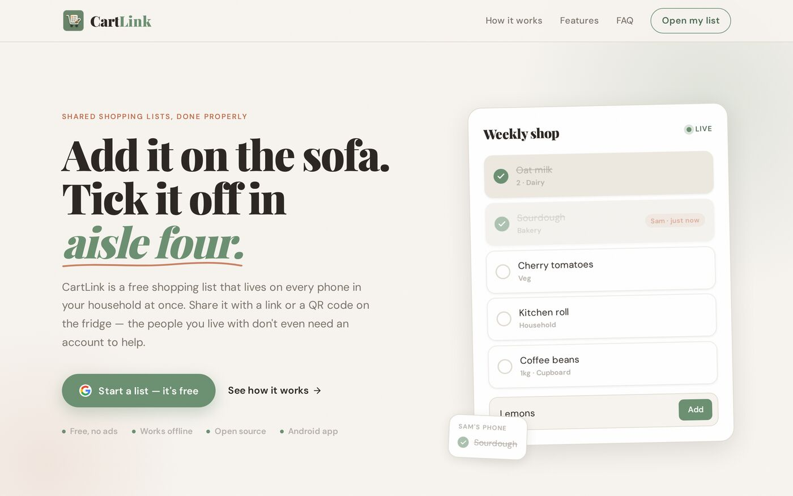

<p align="center">
  <a href="https://cartlink.co.uk"></a>
</p>

<h1 align="center">CartLink</h1>

<p align="center">
  <strong>Add it on the sofa. Tick it off in aisle four.</strong><br/>
  A free shared shopping list that lives on every phone in the house — share it with a link or a QR code, and the people you live with don't even need an account to help.
</p>

<p align="center">
  <a href="https://cartlink.co.uk"><strong>cartlink.co.uk</strong></a> · 
  <a href="https://github.com/openclawed-007/listy/releases/latest">Android APK</a> · 
  <a href="#run-it-yourself">Self-host</a> · 
  <a href="#contributing">Contribute</a>
</p>

<p align="center">
  
  
  
  
  
  
</p>

<p align="center">
  <a href="https://cartlink.co.uk"></a>
</p>

---

## Why this exists

Every "family shopping list" app dies at the same step: getting everyone else in the house to download the thing and make an account. So the list ends up on one phone, and the person in the shop is texting *"did you say oat or almond?"*.

CartLink skips that step. You sign in, add things, and turn on sharing. You get a link and a **QR code you can stick on the fridge**. Anyone who scans it sees the live list on their own phone and can tick things off or add to it — **with no account at all**, if you allow it. Changes land on everyone's screen in real time.

It's small, it's free, there are no ads, and the whole thing is open source.

## What it does

| | |
|---|---|
| ✍️ **One smart field** | Type `2 milk`, `500g flour` or `bread x3` and the quantity is read for you. Adding something already on the list bumps its quantity instead of making a duplicate row. |
| 🧺 **Sorts itself by aisle** | Items are matched against a built-in grocery dictionary and grouped under Produce, Bakery, Dairy & Eggs, and so on. Override any aisle by editing the row, or by typing `batteries #shed`. |
| ⚡ **Real-time sync** | Tick it on one phone, it's gone on all of them. Firestore listeners, no refresh button. |
| 🔗 **Share by code, link or QR** | One toggle gives you a short share code, a URL and a printable QR code — all open the same live list. Turn it off any time and the code is revoked. |
| 👤 **Helpers don't need an account** | Optional guest editing lets anyone with the link tick and add. Guests can *never* delete. |
| 🔒 **Granular permissions** | Let signed-in collaborators tick, add or remove — separately. Enforced in **Firestore security rules**, not just the UI. |
| 🗂️ **Multiple lists & notes** | Keep separate lists, add notes to items, and get typeahead suggestions from things you've bought before. |
| 🧍 **Guest mode** | Use a private list on this device with no account. Sign in later and your guest items are brought into the synced list automatically. |
| ↩️ **Undo delete** | Slipped a thumb in the queue? One tap brings it back. |
| ⌨️ **Keyboard-friendly** | `/` search, `n` new item, `Enter` save, `Esc` cancel. |
| 📶 **Offline** | Keep ticking in the basement supermarket. Changes queue locally and sync when you're back online. |
| 🌙 **Dark mode** | Deep forest palette that follows your device setting until you pick one yourself. No white flash on load. |
| 🔠 **Text size & accessibility** | Small → XL text setting that applies on every screen, 44px touch targets, WCAG-contrast helper text, keyboard-navigable menus. |
| 📱 **Installable + native Android** | Add to home screen as a PWA, or grab the native Kotlin/Compose app from [Releases](https://github.com/openclawed-007/listy/releases/latest). Share links deep-link straight into the app. |

## How sharing works (the interesting bit)

- Your items live in a **private** `shoppingItems` collection only you can read.
- Turning on sharing publishes a snapshot to `sharedLists/{yourId}`, readable by anyone who has the ID (but never listable).
- Signed-in collaborators can import your list as a tab in their own app; ticks flow **both ways**.
- Anonymous visitors on the share page are auto-signed-in anonymously and may only toggle/add when you've enabled it. A shrinking items array from an anonymous writer is **always rejected server-side**.
- App Check is enforced on Firestore so only the real web and Android clients can write.

The full rules are in [`firestore.rules`](./firestore.rules) and explained in [Security](#firestore-security-rules) below.

## Stack

**Web:** React 19 · TypeScript · Vite 7 · React Router 7 · Firebase Auth + Firestore + App Check · `qrcode.react` · Lucide icons · Vitest + Testing Library  
**Android:** Kotlin · Jetpack Compose · Firebase SDK · Credential Manager sign-in · App Links  
**Hosting:** Firebase Hosting

## Run it yourself

Want your own private instance? It's one Firebase project and about ten minutes.

1. **Clone and install**
   ```bash
   git clone https://github.com/openclawed-007/listy.git
   cd listy
   npm install
   ```

2. **Configure Firebase**
   ```bash
   cp .env.example .env.local
   ```
   Then fill in your Firebase project credentials in `.env.local` from the [Firebase Console](https://console.firebase.google.com).

3. **Enable Google Sign-In** in Firebase Console → Authentication → Sign-in providers.

4. **Set Firestore rules** (see `README` Security section below).

5. **Run locally**
   ```bash
   npm run dev
   ```

## Firestore Security Rules

The live ruleset is `firestore.rules` in this repo — deploy it rather than
copying rules out of documentation:

```bash
firebase deploy --only firestore:rules
```

In short: a signed-in user can only read and write their own `shoppingItems`,
and `sharedLists/{ownerId}` is world-readable by document ID but only the owner
may create it, rename it or change its permissions. A signed-in collaborator
may change nothing but the `items` array, and only while the owner has editing
switched on. Rules also block list-size changes that the permission flags
forbid (e.g. adding when only “check off” is granted). Per-item content limits
are still enforced in the client.

## Deploy

```bash
npm run build
firebase deploy
```

## Android app (native)

A fully native Android app lives in [`android/`](./android) — Kotlin + Jetpack
Compose talking straight to Firebase (no web view). It shares the same
Firestore data contract as the web app: private items in `shoppingItems`,
public snapshots in `sharedLists/{ownerId}`, including the owner ↔ collaborator
sync and granular share permissions.

**Features:** native Google Sign-In (Credential Manager), real-time sync with
built-in offline persistence, quantity/category, undo delete, search, list tabs
for imported shared lists, share link + QR code with granular permissions, dark
mode, and App Links so `cartlink.co.uk/share/...` and `/import/...` open in the
app.

### Setup

1. In the [Firebase Console](https://console.firebase.google.com), add an
   **Android app** (package `uk.co.cartlink.app`) to the existing project and
   register your debug and release **SHA-1/SHA-256 fingerprints**
   (`./gradlew signingReport`). This is required for Google Sign-In and App
   Check (Play Integrity).
2. Download `google-services.json` into `android/app/` (gitignored; see
   `android/app/google-services.example.json` for the expected shape).
3. Because App Check is enforced on Firestore, register the app in
   **App Check**: Play Integrity for release; for debug builds copy the debug
   token printed in Logcat into the console.
4. Build:
   ```bash
   cd android
   gradle :app:assembleDebug   # requires JDK 17–21 and the Android SDK
   ```

Release builds are signed with `android/keystore.properties` +
`android/keystore/` when present (both gitignored). The site already serves
`public/.well-known/assetlinks.json` so App Links verify against the release
signing key.

## Checks

```bash
npm run lint
npm run typecheck
npm run test
npm run build
```

`npm run build` type-checks the whole project (`tsc -b`) before bundling, so
a type error fails the build and CI rather than shipping.

## Contributing

Bug reports and small, focused PRs are very welcome. If you've stood in a supermarket wishing the list did something, [open an issue](https://github.com/openclawed-007/listy/issues) and describe the moment — that's exactly how most of the current features started.

Before opening a PR, please run the three checks above. Tests live next to the components (`*.test.tsx`) and use Vitest + Testing Library with Firebase mocked, so you don't need a Firebase project to run them.

## Spread the word

If CartLink saved you a "did we need milk?" text, a ⭐ on this repo or a link to [cartlink.co.uk](https://cartlink.co.uk) genuinely helps more people find it. Ready-to-post copy for various places lives in [`marketing/`](./marketing).

---

<p align="center">Made in the UK · <a href="https://cartlink.co.uk/privacy">Privacy</a> · <a href="https://cartlink.co.uk/terms">Terms</a> · <a href="mailto:hello@cartlink.co.uk">hello@cartlink.co.uk</a></p>
